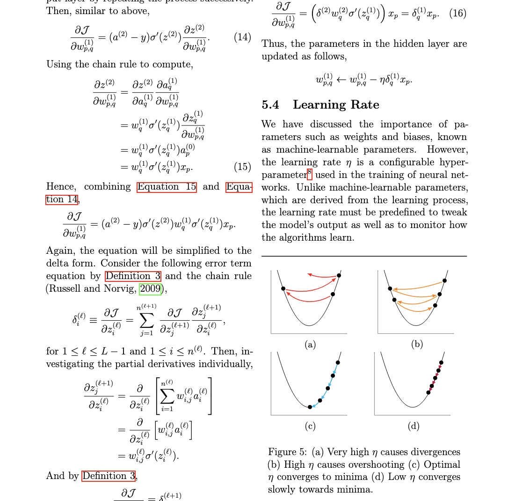

# A Mathematical Introduction to Artificial Neural Networks

Final year paper about Artificial Neural Networks written in LaTeX (using Overleaf + MikTeX). Below is a sample of the compiled article.

